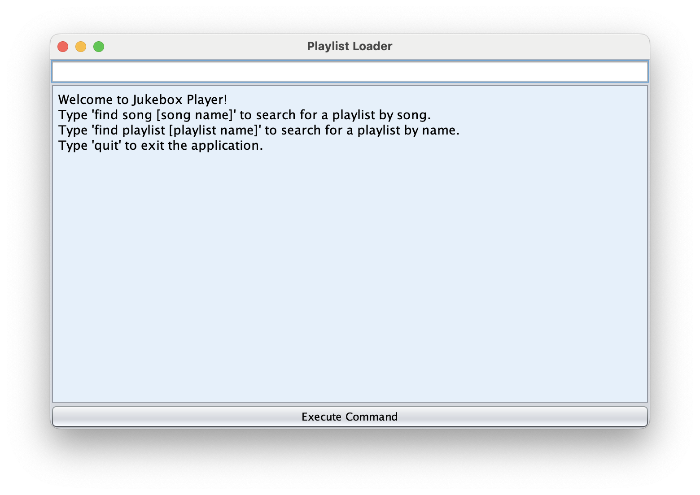
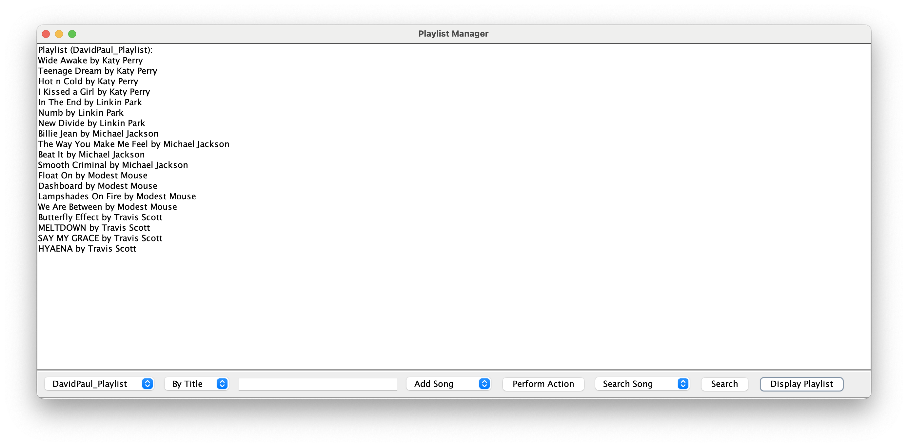
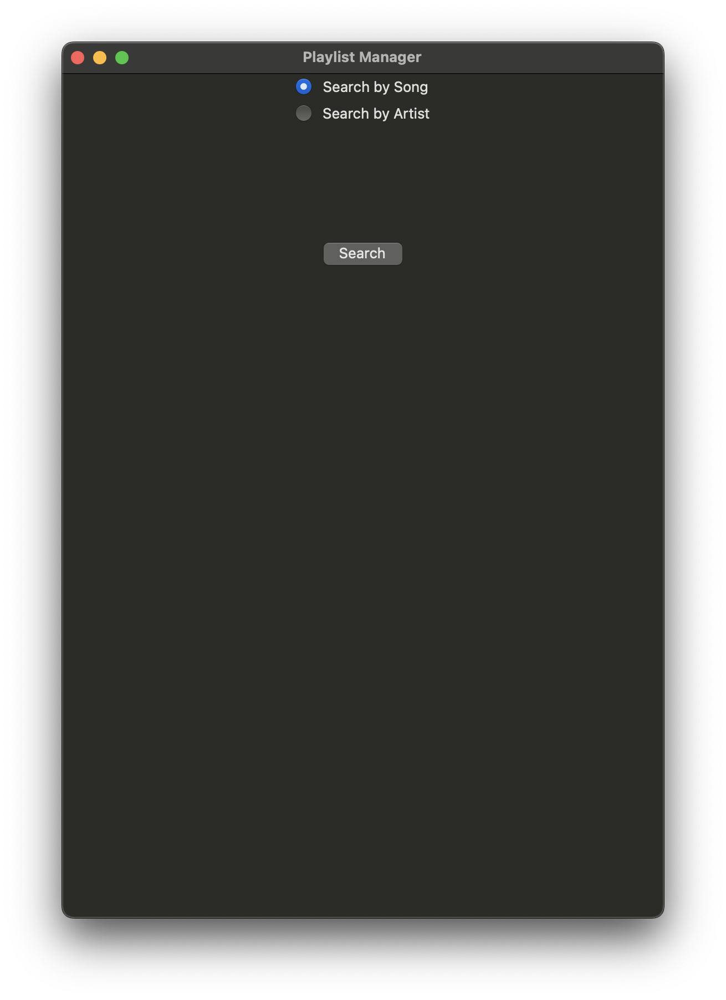

# 
Computer Science Capstone

  
## 
CS-499 | SNHU

#### CODE REVIEW

A code review is meant to improve the quality of the code being reviewed. It can be used to share knowledge, maintain consistency, and mentor and teach. 

<code>You can watch the code review <a href="">here</a>.</code>

#### Software Engineering and Design

The first artifact of this portfolio is going to be making a GUI for the Jukebox Player, expanding on the functionality of the existing classes to 
expand the functionality of the GUI.

  

<code>Click here to see the report and the <a href="https://github.com/SenseiBaez/MiguelBaez.github.io/tree/Enhancement-One">code</a>.</code>

#### Algorithms and Data Structures

The second artifact is implementing a HashMap in the student playlists and creating a GUI to showcase its functionality.

  

<code>Click here to see the report and the <a href="https://github.com/SenseiBaez/MiguelBaez.github.io/tree/Enhacnement-Two">code</a>.</code>

#### Databases

The third artifact was creating a database from all the user data from the Jukebox player. The database was created using SQL and the GUI was created using Python.

  

<code>Click here to see the report and the <a href="https://github.com/SenseiBaez/MiguelBaez.github.io/tree/Enhancement-Three">code</a>.</code>

